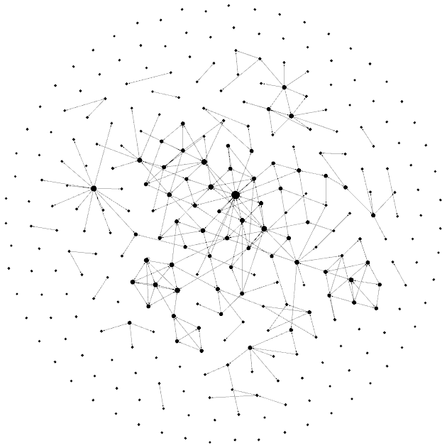

# README

## Example output



## Usage

```
bundle exec ruby main.rb > graph.gexf
```

Now, open that file (graph.gexf) with Gephi, and you should see a graph that was generated with your Joplin database. Given that you have links between your notes.
Otherwise it'll be only dots everywhere and no link between them.

## Debugging

If you have issues opening your gexf file with Gephi, try this:

```
xmllint --noout --schema basic-gexf-1.2.xsd graph.gexf
```

It will show you what are the issues you need to fix for the xml to be valid.
